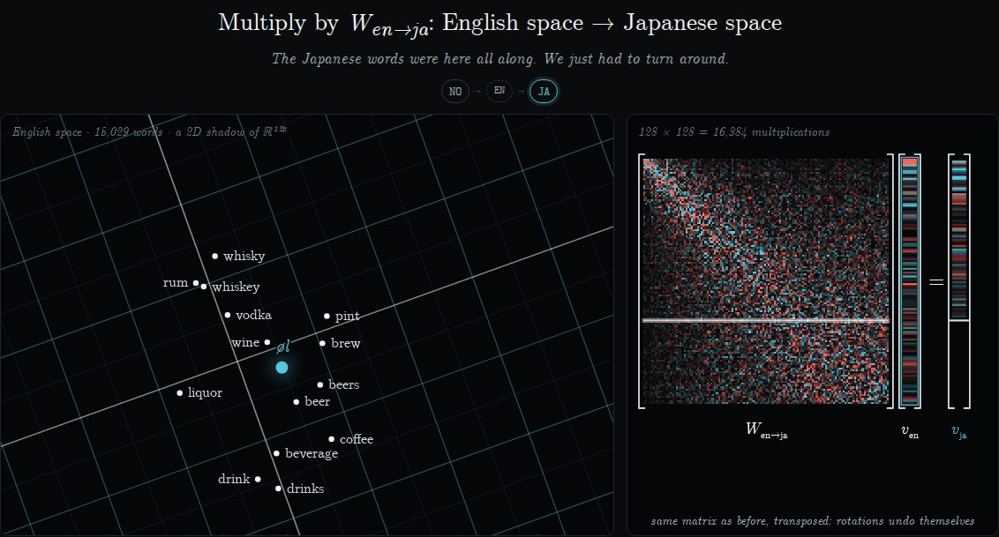

# Translator Translator Translator

**A translator that translates using only translations.**

You type a word. It becomes 128 numbers. Those numbers get multiplied by a rotation matrix or two,
and whatever word lands closest on the other side is your translation. There's no dictionary lookup
at runtime, no grammar, no AI, and no server. It's linear algebra running in your browser, with
an animation so you can watch the vector make the trip.



12 languages: English, Norwegian, Japanese, Spanish, German, French, Italian, Portuguese, Dutch,
Polish, Greek and Chinese.

## How it works

1. **Every word is a point.** Each language has its own word embedding, learned separately from
   its own text. Each one is squashed to 128 dimensions.
2. **The clouds have the same shape.** Every language needs words for cats, dogs and beer, so one
   cloud is roughly a rotated copy of another ([Mikolov et al., 2013](https://arxiv.org/abs/1309.4168)).
3. **Find the rotation using translations.** From a few thousand known translation pairs
   (`katt ↔ cat`, …) we solve the orthogonal Procrustes problem, `W = UVᵀ` where `UΣVᵀ = svd(XᵀY)`,
   and polish it with a few rounds of self-learning ([Artetxe et al., 2017](https://aclanthology.org/P17-1042/)).
   So yes, the translator is built from translations. That's the joke.
4. **Everything goes through English.** English is where the dictionaries are, so it's the hub:
   `v_ja = W_jaᵀ · W_no · v_no`. Because rotations are their own inverse, detours in Express mode
   cancel out exactly.
5. **Pick the nearest word** by cosine similarity. In **Telephone** mode that happens at every stop,
   which is where the drift (and most of the comedy) comes from. Try the **Grand Tour**.

### How good is it?

Top guess on held-out words, translating into English, counted as correct if it shares a Wordnet
synset with the source word:

| es | fr | el | pt | it | no | nl | pl | ja | zh | de |
|----|----|----|----|----|----|----|----|----|----|----|
| 71% | 65% | 64% | 61% | 58% | 58% | 53% | 49% | 44% | 34% | 32% |

Common words mostly come out right (`øl → ビール`, `penguin → pingvin`). Less common ones produce
gems like `hedgehog → ピカチュウ` or `waffle → sandwicher`. A Grand Tour from "cat" once went
`cat → katt → 猫 → gato → Hamster → hamster → criceto → cachorro → hond → pies → σκύλος → dog`.

## Running it

It's a static site with no build step. `fetch` won't read files from `file://`, so serve the folder
over HTTP:

```sh
python3 -m http.server 8000   # then open http://localhost:8000
```

To host it on GitHub Pages: *Settings → Pages → Deploy from a branch*, choose the branch and `/ (root)`.

Tests use Node's built-in runner, no dependencies:

```sh
npm test
```

## Layout

| Path | What |
|------|------|
| `index.html`, `css/` | the page |
| `js/linalg.js` | dot products, the two matrix-vector products, top-k, a tiny PCA |
| `js/translate.js` | plans a word's route: look up → rotate → rotate → nearest word |
| `js/stage.js` | the 2D "embedding space" canvas: grid, words, rotations |
| `js/mathview.js` | the matrix × vector panel and the similarity histogram |
| `js/main.js` | UI wiring and the animation script |
| `js/quips.js` | every joke, quarantined |
| `data/` | per language: `xx.json` (word list) and `xx.bin` (matrix + int8 vectors), plus `manifest.json` |
| `scripts/build_data.py` | rebuilds `data/` from scratch |

### Rebuilding the data

```sh
pip install -r scripts/requirements.txt
python scripts/build_data.py            # downloads ~5 GB of spaCy models; needs ~12 GB free in .cache/
```

Vocabulary is the 15,000 most frequent words per language (by [wordfreq](https://github.com/rspeer/wordfreq)),
plus a few hundred words people will obviously try ("penguin", "unicorn", "waffle"). Each language's
own matrix pulls those in from a larger pool of less common words. Vectors are PCA-reduced to 128
dimensions and stored as int8 (about 2 MB per language, loaded only when needed).

## Credits and licences

- Word vectors: [spaCy](https://spacy.io/models) `*_core_*_lg` models. Explosion's fastText vectors
  are CC0; Japanese uses [chiVe](https://github.com/WorksApplications/chiVe) (Apache-2.0).
- Translation pairs (training only, not shipped): [Open Multilingual Wordnet 1.4](https://github.com/omwn/omw-data)
  and [OdeNet](https://github.com/hdaSprachtechnologie/odenet), under their respective licences.
- Font: Computer Modern Unicode, SIL Open Font License (`fonts/OFL.txt`).
- Look and feel: shamelessly inspired by [3Blue1Brown](https://www.3blue1brown.com/).
